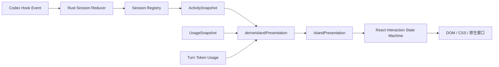
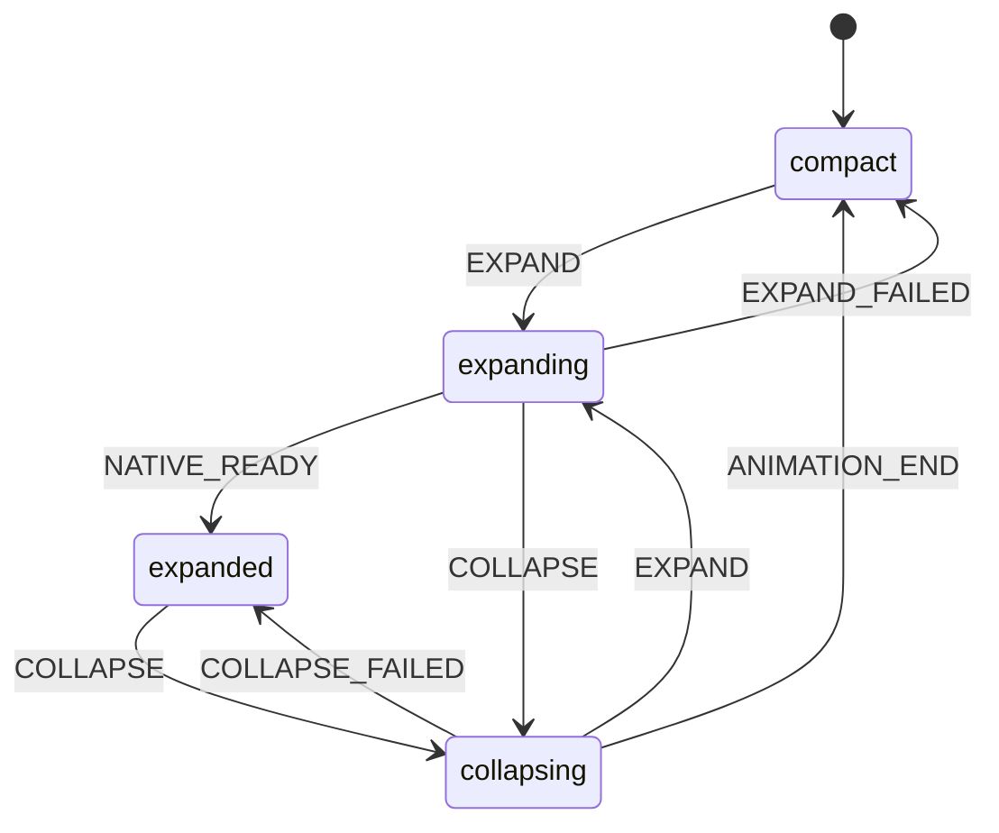

# 状态系统与事件流

本文记录当前实现，修改状态规则时应同步更新本文和相关测试。主要代码位于 `src-tauri/src/activity.rs`、`src/islandState.ts`、`src/turnTokenUsage.ts`、`src/islandInteraction.ts` 和 `src/App.tsx`。

## 状态归属

| 维度 | 所属层 | 当前取值或内容 | 含义 |
| --- | --- | --- | --- |
| Lifecycle | Rust Session | `idle`、`active` | 当前 Turn 是否在活动阶段；`SessionEnd` 结束 Session 生命周期 |
| Activity | Rust Session / Agent | `thinking`、`working`、`searching`、`editing`、`executing`、`connecting`、`compacting` | Codex 正在做什么；非活动时为 `null` |
| Attention | Rust Session / Agent | `none`、`permission` | 用户是否需要处理审批，不覆盖 Activity |
| Turn Result | Rust Registry | `completed`、`interrupted`，附 Session ID、Turn ID、完成时间 | 单个 Root Turn 的结果；不属于 Session Activity |
| Token Usage | React 查询状态 | `loading`、`ready`、`unavailable` | 附属于 Completed Turn Result |
| Presentation | TypeScript 纯函数 | `layout`、`attention`、`feedback`、文案、Orb 等 | 决定界面显示什么 |
| Interaction | React reducer | `compact`、`expanding`、`expanded`、`collapsing` | 控制展开动画与原生窗口操作 |

`ActivitySnapshot` 包含当前活动的 `sessions`、独立的 `recentResults` 和 `updatedAt`。`App.tsx` 通过 `activity-updated` 订阅更新，首次加载使用 `read_activity`；`newerActivity()` 拒绝较旧的快照。额度由另一条链路提供，不写入 Session Activity。

## Rust 事件归约

HTTP Hook 只读取状态所需的元数据，`apply_event()` 检查 Turn 身份后调用 `reduce_session()`。会话字段、Agent、ActiveTool 和 Result 的业务转换集中在 reducer；Registry 管理索引、结果列表与清理时间。

| Hook 事件 | Root Turn / Session 的转换 | Agent 事件的转换 |
| --- | --- | --- |
| `SessionStart` | 建立或更新会话元数据，不启动 Turn | — |
| `UserPromptSubmit` | 清除旧 Tool，设置新 Turn ID、`active + thinking + none` | 活动 Root 下设 Agent 为 `thinking + none` |
| `PreToolUse` | 登记 ActiveTool，清除 Root Attention，按前台 Tool 推导 Activity | 登记 Agent Tool，Agent 设为 `working + none` |
| `PostToolUse` | 只移除匹配 Tool，清除 Root Attention，重新计算前台 Activity | 移除匹配 Agent Tool，Agent 回到 `thinking + none` |
| `PermissionRequest` | Attention 设为 `permission`，保留当前 Activity | Agent Attention 设为 `permission` |
| `PreCompact` / `PostCompact` | Root 基础 Activity 在 `compacting` / `thinking` 间切换 | Agent Activity 在 `compacting` / `thinking` 间切换 |
| `SubagentStart` / `SubagentStop` | Root Activity 不被 Agent 生命周期直接覆盖 | Agent 开始为 `thinking`；结束后 Activity 为 `null` 并清理其 Tool |
| `Stop` | 活动 Root 生成 `completed` Turn Result，结束当前 Turn、清理 Tool | 只结束该 Agent，不生成 Root Result |
| `Interrupt` | 活动 Root 生成 `interrupted` Turn Result，结束当前 Turn、清理 Tool | 只结束该 Agent，不生成 Root Result |
| `SessionEnd` | 结束 Session 生命周期、清理 Tool 和 Agent；不再生成 Result | — |

当事件带 Turn ID 且与当前 Turn 不一致时，旧事件被忽略；没有 Turn ID 的旧 Hook 保持兼容。Root 已结束时，迟到的同 Turn 事件和 Agent 事件不会重新激活 Session。Session 是否过期只由 Rust 清理：普通状态 10 分钟，Permission 或仍有 ActiveTool 时 2 小时；Recent Result 保留 12 秒。快照仅发送活动 Session，但可以发送仍在保留期内的 Result。

ActiveTool、前台 Activity、当前命令是不同概念。`tool_activity()` 是唯一的 Tool 分类入口。前台选择优先取最近启动的 Root Tool，否则取最近启动的 Agent Tool，最后回到 Root 基础 Activity。因此 Bash 仍运行时，随后启动的 Root Read 会暂时显示 `searching`；Read 结束后恢复 Bash 的 `executing`。`currentCommand` 只来自前台的 Root 执行类 Tool。

## Presentation 与 Result 展示

`deriveIslandPresentation()` 是纯函数，输入 ActivitySnapshot、额度、Token 状态、当前时间和展开期间保留的 Result。优先级依次为：Permission、额度用尽、活动多 Session、活动单 Session、Interrupted Result、Completed Result、Idle。`layout` 只取 `minimal`、`single`、`multi`；Attention 和 Feedback 独立存在。例如多 Session 等待审批仍是 `layout=multi, attention=permission`。Orb 表示动作，Ring / Feedback 表示审批、额度或完成反馈；Activity 到文案及 Orb 的映射也集中在此文件。

紧凑态的 Result 默认展示 3 秒。Completed 的 Token 在准备好后还能展示约 2.8 秒；`loading` 与 `unavailable` 的主文案均为“已完成”，`ready` 且有本次 Token 时显示“完成 · 数量”。展开期间，`App.tsx` 保留最新 Result，直到收起后才释放；即使 Rust 的 12 秒保留期结束，展开内容与已查询到的 Token 仍可显示。活跃 Session、Permission 和额度的展示优先级仍高于 Result。

Token 查询由 Completed Turn Result 驱动，键优先使用 `sessionId:turnId`；旧 Hook 缺 Turn ID 时才使用完成时间构成回退键。`useTurnTokenUsage()` 在 300、800、800 毫秒后依次尝试查询，得到本次 Token 设为 `ready`，连续无数据或调用失败设为 `unavailable`。Interrupted Result 不查询 Token。

## React 展开与窗口交互

`App.tsx` 用 `useReducer` 维护交互阶段，拖动另行管理。原生窗口尺寸与点击区域操作通过队列串行执行，避免快速展开/收起时旧异步操作覆盖新状态。展开时先放大原生窗口并设置点击区域，再进入 `expanded`；收起时先播放 340 毫秒 Morph，再缩小原生窗口。鼠标离开岛区域后等待 1 秒才自动收起；在等待期间重新进入会取消计时。展开过程中鼠标离开也遵守同一个延迟。用户点击收起仍立即开始收起过程。

DOM 同时保留 `layout-*` 与 `expanded` 类，并以 `data-attention`、`data-feedback` 表示其它维度。CSS 不自行推断业务状态。Rust 状态机测试位于 `activity.rs`；Presentation 与 Interaction 测试位于 `tests/islandState.test.mjs`。真实窗口尺寸、Hit Region、Hook 信任与自动启动仍需在 Windows 运行环境中回归。
